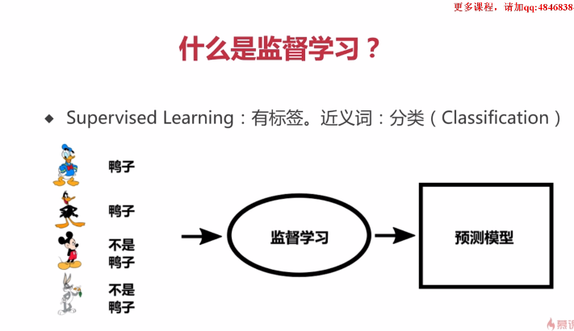

#### 人工智能简单来说就是一种人昂计算机程序能够智能的思考的方式,人工智能主要包括,机器学习和深度学习

##### 1.AI全称:Artificial Intelligence,与此对应的是NI: Natural Intelligence,指自然界的生物

##### 2.一文看懂70年的人工智能简史:<http://www.elecfans.com/d/930779.html>

##### 3.需要的数学知识: 1微积分 2.线性代数 3.统计学

##### 4.人工智能和机器学习的关系

5.为什么需要机器学习,之前的if else判断不可以么

很多软件无法靠人工编程:自动驾驶,自然语言处理等

6.人类思考与机器学习之前的区别

机器学习的分类:1.监督学习2.非监督学习3.半监督学习4.强化学习

监督学习又包含分类与回归

**分类问题是用于将事物打上一个标签，通常结果为离散值。**例如判断一幅图片上的动物是一只猫还是一只狗，分类通常是建立在回归之上，分类的最后一层通常要使用softmax函数进行判断其所属类别。分类并没有逼近的概念，最终正确结果只有一个，错误的就是错误的，不会有相近的概念。最常见的分类方法是逻辑回归，或者叫逻辑分类。

回归与分类的不同

**回归问题通常是用来预测一个值**，如预测房价、未来的天气情况等等，例如一个产品的实际价格为500元，通过[回归分析](https://so.csdn.net/so/search?q=回归分析&spm=1001.2101.3001.7020)预测值为499元，我们认为这是一个比较好的回归分析。一个比较常见的回归算法是线性回归算法（LR）。另外，回归分析用在神经网络上，其最上层是不需要加上softmax函数的，而是直接对前一层累加即可。回归是对真实值的一种逼近预测。

名词解释:

举例:分类:

有标签,有答案,属于分类问题,应用场景（预测的结果是离散的，例如预测明天天气-阴，晴，雨）

一堆数据,自己找到之间的关联和区别

ai自动玩游戏

##### 7.深度学习

***************************************************************************************************************

如何写代码

使用TensorFlow:google开源科学计算库

不同角度,T或者F

可视化:http://playground.tensorflow.org

安装:目前python2已无法安装,必须使用python3.7以上

使用命令安装: pip install tensorflow==1.13.1 没有显卡就安装cpu版本,用来学习

名词解释:
1.Tensor:张量

 TensorFlow中的张量就是一个n维的[数组](https://so.csdn.net/so/search?q=数组&spm=1001.2101.3001.7020)，Tensor具有两个重要的属性，包括张量的数据类型(dtype)及张量的形状(shape)。 

主要的张量包括：

a.tf.Variable 变量张量，一般表示机器学习参数

b.tf.constant 常量张量，一般用来表示常量，不可改变

c.tf.placeholder 占位符张量，一般用来表示机器学习中输入的数据 ![[公式]](https://www.zhihu.com/equation?tex=%5Cleft%5C%7B+x%2Cy+%5Cright%5C%7D)

`import tensorflow as tf`
`//定义了⼀个张量，有6个元素，设置他的形状是[2.3]`
`a = tf.constant([1,2,3,4,5,6], shape=[2,3])`
`with tf.Session() as session:`
`print(session.run(a))`

2.Session是什么:

 TensorFlow中只有让Graph（计算图）上的节点在Session（会话）中执行，才会得到结果。Session的开启涉及真实的运算，因此比较消耗资源。在使用结束后，务必关闭Session。 

例如:

 上述这种方式需要手动关闭Session，比较繁琐。我们可以采用另一种形式，可以不用手动关闭会话。实质就是指定Session的有效范围，离开有效范围自动失效。 

3.梯度下降

  

y=kx+b

可以理解为为了找到最合适的k值,情形1和情形2都不是最小的值,只有无限接近于0,才是最符合的k值,

计算过程见pdf

4.归一化

可以理解为为了找到最合适的k值,情形1和情形2都不是最小的值,只有无限接近于0,才是最符合的k值,

计算过程见pdf

1）归一化是指归纳同意样本的统计分布性，归一化在0-1之间是统计概率分布，归一化在-1----+1之间是统计的坐标分布。

比如房价1万,2万这样的数据,后面再乘起来太大了,都把他变成1,2方便计算

2）归一化处理的目的

为了后面数据处理方便，归一化可以避免一些不必要的数值问题。
为了程序运行时收敛加快。
统一量纲。样本数据的评价标准不一样，需要对其量纲化，统一评价标准。

5.神经元

  

单个神经元网络模型如上图所示，计算公式如下：

y = x0w+x1w+...+xnw+b=Ʃwi × xi  + b = w • x + b

其中，y为输出结果，x为输入，w为权重，b为偏置。

训练神经网络，其实就是不断的调整w和b的值，使之得到一个合适的值，最终这个值配合运算公式形成的逻辑，就是神经网络的模型。

  

后一值的输入是前一值的输出,这样形成一个网络,就是神经网络

其他非线性的问题需要用到的计算模型

他们需要用到激活函数,简单理解就是给计算结果乘以一个数,让结果变的更加复杂,还有隐层的概念

CNN卷积神经网络

类似于高精度图片缩成低精度

RNN-LSTM循环神经网络
GAN(生成对抗网络)

本质就是对y=kx+b的模拟,只不过很多问题是曲线或者根本不是线性的

demo代码:波士顿房价预测:https://blog.csdn.net/qq_24211837/article/details/122132162

招聘现状:要求高,985,211,学历高,难度大,工资高,岗位少,据说卷的厉害